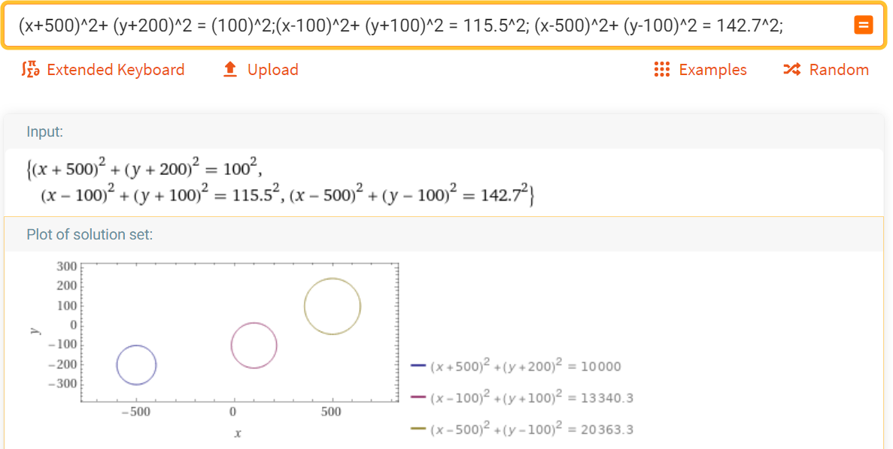
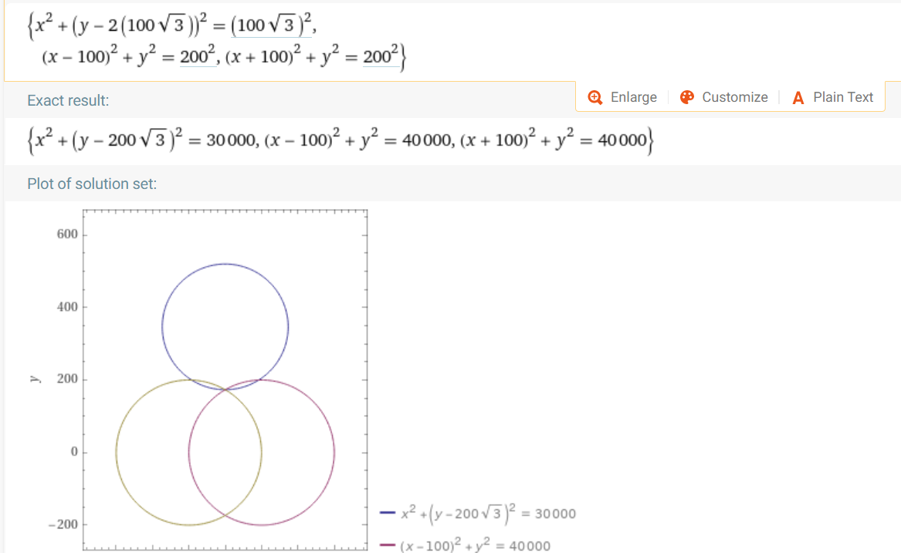
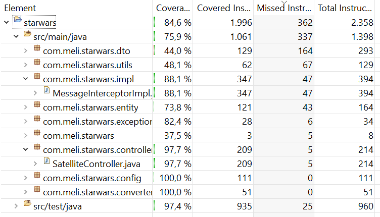

# Solución prueba starwars - Mercado libre


- [Ejercicio](#ejercicio)
  - [Implementación y tecnologias usadas](#Implementacion)
  - [Comentarios relevantes](#comentarios)
  - [Algoritmo](#Algoritmo)
- [Setup](#setup)
  - [Instrucciones](#instrucciones)
  - [Uso](#uso)
  - [API Url](#API Url)
  - [Servicios](#servicios)
    - [TopSecret](#TopSecret)
    - [TopSecret_Split (POST)](#TopSecret_Split-POST)
    - [TopSecret_SPLIT (GET)](#TopSecret_Split-GET)
- [Test](#test)
  - [Automaticos](#automaticos)
- [Inconvenientes](#Inconvenientes)
- [Mejoras](#Mejoras)

## Ejercicio

### [Implementación y tecnologias usadas](#Implementacion)

- Java 8
- Spring
- H2
- JUnit
- Swagger-ui-express
- Heroku
- Maven
- GitHub

### Comentarios

La solución propuesta se desarrolló en Java, ya que es un lenguaje en el que el desarrollador tiene experiencia, esto le permitió optimizar el tiempo para llegar a una solución exitosa del problema.

Al igual que java, la demás herramientas utilizadas se seleccionaron por diferentes características para llegar a la mejor solución posible. Esto complementado con ser herramientas ya utilizadas por el programador. 

En la base de datos se utilizó H2 se escogió por ser una base de datos en memoria que el mismo proyecto correría. 

Spring se utilizó por sus multiples y completas herramientas para crear una API Rest.

Junit permite un amplio testeo de la aplicación e incluye Mockito lo que habilita las ventajas de mockear diferentes clases, métodos o interacciones.

Swagger es una herramienta de documentación muy sencilla de implementar y de usar y entender para el usuario final.

Para el despliegue se intentó desplegar inicialmente en Azure pero multiples inconvenientes que se mostrarán más adelante hicieron que se decidiera por un despliegue en Heroku.

## Algoritmo

Para encontrar la posición de la nave se resolvió utilizando el algoritmo de trilateración, la traslación y rotación del plano cartesiano. La documentación se puede encontrar en:

Trilateración:
http://repositoriodigital.uns.edu.ar/bitstream/123456789/4671/3/La%20matem%C3%A1tica%20detr%C3%A1s%20del%20GPS.pdf

Traslación y Rotación: https://matematicasn.blogspot.com/2015/12/traslacion-y-rotacion-de-ejes-de.html#:~:text=Es%20verdad%20que%2C%20por%20una,ecuaciones%20en%20formas%20m%C3%A1s%20simples.&text=Si%20una%20ecuaci%C3%B3n%20es%20transformada,simplificaci%C3%B3n%20por%20transformaci%C3%B3n%20de%20coordenadas.

El ejemplo en el PDF del proyecto no se podía resolver porque los satelites estaban ubicados a una distancia que no cruzaba con el punto de origen:



Esto se puede comporbar en el sigueinte link:

https://www.wolframalpha.com/input/?i=%28x%2B500%29%5E2%2B+%28y%2B200%29%5E2+%3D+%28100%29%5E2%3B%28x-100%29%5E2%2B+%28y%2B100%29%5E2+%3D+115.5%5E2%3B+%28x-500%29%5E2%2B+%28y-100%29%5E2+%3D+142.7%5E2%3B

Por lo tanto se decidió cambiar el origen de los satelites y la distancia al punto de origen para probar el algoritmo. Sin embargo en el despliegue están las ubicaciones mencionadas en el PDF del desafio:

● Kenobi: [-500, -200]
● Skywalker: [100, -100]
● Sato: [500, 100]

Minetras tanto los parámetros seleccionados para probar el sistema fueron:

Ubicación:

● Kenobi: [0, 2*100*sqrt(3)]
● Skywalker: [100, 0]
● Sato: [-100, 0]

Distancia

● Kenobi: 100sqr(3)
● Skywalker: 200
● Sato: 200



Esto se puede comporbar en el sigueinte link:

https://www.wolframalpha.com/input/?i=%28x%29%5E2%2B+%28y-2*%28100sqr%283%29%29%29%5E2+%3D+%28100sqr%283%29%29%5E2%3B%28x-100%29%5E2%2B+%28y%29%5E2+%3D+200%5E2%3B+%28x%2B100%29%5E2%2B+%28y%29%5E2+%3D+200%5E2%3B

## Setup

### Instrucciones

#### Prerequisitos

Para correr la aplicación en su máquina local es necesario tener instalado Java 8 y Maven.

#### Descarga

El proyecto se puede obtener desde github, para ello puede clonarlo utizando el siguiente comando:

```
  git clone https://github.com/CamiloHernandezC/starwars.git
```

#### Dependencias

La administración de dependencias se hizo utilizando maven. Por lo cual puede abrir una terminal, ir al folder del proyecto y utilizar el comando:

```
mvn clean install -U
```

#### Iniciación

Para iniciar la aplicación en la terminal puede utilizar el comando:

```
mvn  spring-boot:run
```
Si todo está bien en el puerto 8080 (puerto utilizado por defecto) podrá ver la documentación de swagger, en la cual encontrará los endpoints disponibles. Dicha documentación la encontrará en :

http://localhost:8080/swagger-ui.html

### API Url

Como se mencionó anteriormente la dirección local del proyecto se encuentra en:

http://localhost:8080/

La URL del despliegue de Heroku se encuentra en:

https://meli-starwars.herokuapp.com/

### Servicios

Además de los servicios CRUD para los satellites se tienen los siguientes endpoints:

#### TopSecret

Con este servicio se puede obtener la ubicación de la nave y el mensaje que emite. Pasando como parámetros la distancias y el mensaje captado por los satelites aliados.

Request:

- POST https://meli-starwars.herokuapp.com/topsecret

Request body:

```
    {
"satellites": [
{
“name”: "kenobi",
“distance”: 100.0,
“message”: ["este", "", "", "mensaje", ""]
},
{
“name”: "skywalker",
“distance”: 115.5
“message”: ["", "es", "", "", "secreto"]
},
{
“name”: "sato",
“distance”: 142.7
“message”: ["este", "", "un", "", ""]
}
]
}
```

Response:

```
  Status - 200 OK
    "position": {
"x": -100.0,
"y": 75.5
},
"message": "este es un mensaje secreto"
```
CUando no se pueda determinar la posición o el mensaje, retorna:

Response:

```
  Status - 404 OK
```
#### TopSecret_Split-POST

Con el verbo POST podrá recibir la distancia y mensaje interceptado por cada uno de los satelites de manera independiente.

Request:

- POST /topsecret_split/{satellite_name}

Request body:

```
{
"distance": 100.0,
"message": ["este", "", "", "mensaje", ""]
}
```

Response:

```
  Status - 200 OK
{
    "name": "Sato",
    "x": 500.0,
    "y": 100.0,
    "distance": 100.0,
    "message": [
        "este",
        "",
        "",
        "mensaje",
        ""
    ]
}
```
CUando no se pueda encontrar el satelite, retorna:

Response:

```
  Status - 404 OK
  
  Could not find satellite
```

#### TopSecret_Split-GET

Con el verbo GET podrá determinar la posición y el mensaje interceptado.

Request:

- GET /topsecret_split

Response:

```
  Status - 200 OK
{
"position": {
"x": -100.0,
"y": 75.5
},
"message": "este es un mensaje secreto"
}

```
Cuando no se pueda determinar la información:

Response:

```
  Status - 404 OK

```

Adicionalmente le mostrará un mensaje con información de porqué no se pudo obtener la posición o el mensaje. por ejemplo:

Si no hay suficientes satelites (se requieren al menos 3 satelites):

```
You need at least 3 satellites to determine position
```
Si la posición no pudo ser determinada, porque la multilateración no pudo ser resuelta:

```
The position can't be determined
```

### Test

#### Automaticos

Para los test se utilizó Junit y se trató de tener la mayor covertura posible, enfocandose en los controladores y la implementación de las interfaces utilizadas.


